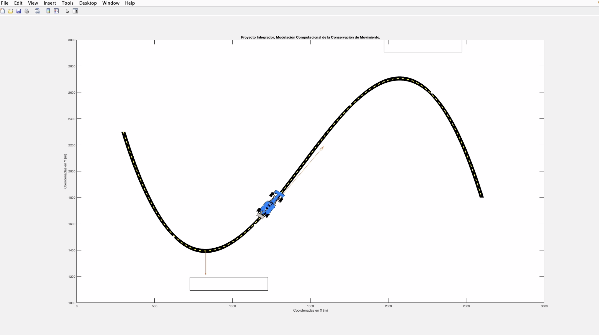

# Race Track Modelling
## ITESM, Computational Modeling Applying Conservation Laws, Final Project 

To run this project, you **must** need to use either MATLAB or any other open source alternative like GNU Onclave. 
After that, just run `reto.m`.

### Preview Image:
